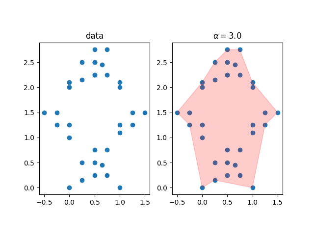
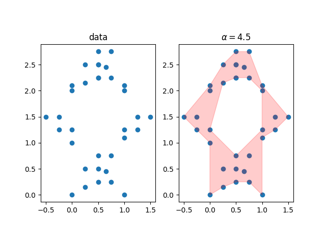
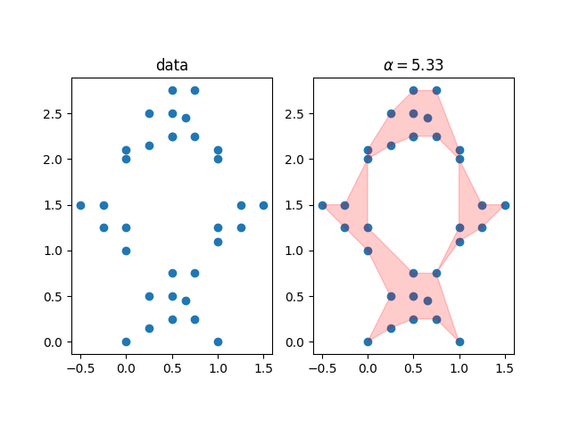
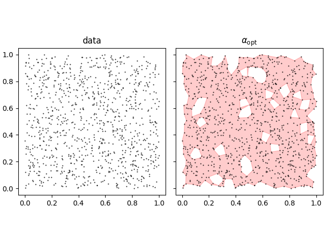
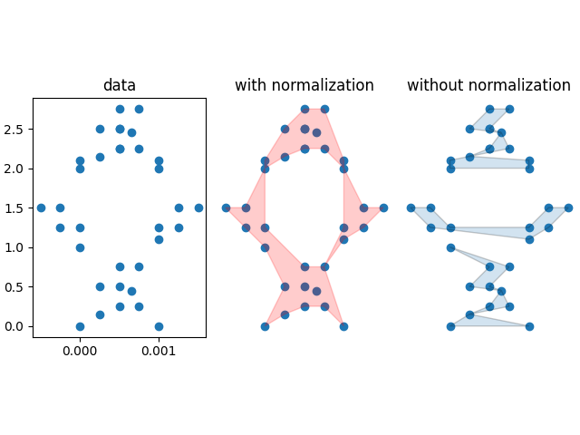

# alpha_shapes
A Python library for reconstructing the shape of a 2D point cloud on the plane.

[TOC]

## Usage
Imports:
```python
import matplotlib.pyplot as plt
from descartes import PolygonPatch
from alpha_shapes.alpha_shapes import Alpha_Shaper
```
Define a set of points:
```python
points = [(0.,     0.),    (0.,    1.),    (1.,     1.1),
          (1.,     0.),    (0.25,  0.15),  (0.65,   0.45),
          (0.75,   0.75),  (0.5,   0.5),   (0.5,    0.25),
          (0.5,    0.75),  (0.25,  0.5),   (0.75,   0.25),
          (0.,     2.),    (0.,    2.1),   (1.,     2.1),
          (0.5,    2.5),   (-0.5,  1.5),   (-0.25,  1.5),
          (-0.25,  1.25),  (0,     1.25),  (1.5,    1.5),
          (1.25,   1.5),   (1.25,  1.25),  (1,      1.25),
          (0.5,    2.25),  (1.,    2.),    (0.25,   2.15),
          (0.65,   2.45),  (0.75,  2.75),  (0.5,    2.25),
          (0.5,    2.75),  (0.25,  2.5),   (0.75,   2.25)]
```
Create the alpha shaper:
```python
shaper = Alpha_Shaper(points)
```
For the alpha shape to be calculated, the user must choose a value for the `alpha` parameter.
Here, let us set `alpha` to 3.0:
```python
alpha = 3.0
alpha_shape = shaper.get_shape(alpha=alpha)
```
Visualize the result:
```python
fig, (ax0, ax1) = plt.subplots(1, 2)
ax0.scatter(*zip(*points))
ax0.set_title('data')
ax1.scatter(*zip(*points))
ax1.add_patch(PolygonPatch(alpha_shape, alpha=0.2, color='r'))
ax1.set_title(f"$\\alpha={alpha:.2}$")

for ax in (ax0, ax1):
    ax.set_aspect('equal')
plt.show()
```
 

The resulting shape is only a rough outline of the figure formed by the point set. 
However, increasing the value of `alpha` to 4.5 yields much better results.
```python
alpha = 4.5
alpha_shape = shaper.get_shape(alpha=alpha)
```
 

##  Features
###  Optimization
A satisfactory calculation of the alpha shape requires a successful guess of the alpha parameter. While trial and error might work well in some cases, users can let the `Alpha_Shaper` choose a value for them. That is what the `optimize` method is about.
```python
>>> alpha_opt, alpha_shape = shaper.optimize()
>>> alpha_opt
5.331459512629295
```
 

The optimize method runs efficiently for relatively large point clouds. Here we calculate the optimal alpha shape of an ensemble of 1000 random points uniformly distributed on the unit square.  

```python
>>> from time import time
>>> points = np.random.random((1000, 2))
>>> alpha_shaper = Alpha_Shaper(points)
>>> ts = time()
>>> alpha_opt, alpha_shape = alpha_shaper.optimize()
>>> te = time()
>>> print(f'optimization took: {te-ts:.2} sec')
optimization took: 0.41 sec
```
 

###  Normalization
Before calculating the alpha shape, Alpha_Shaper normalizes by default the input points so that they are distributed on the unit square. When there is a scale separation along the x and y direction, deactivating this feature may yield surprising results.
```python
import numpy as np
# Scale the points along the x-dimension
x_scale = 1e-3
points = np.array(points)
points[:, 0] *= x_scale

#  Create the alpha shape without accounting for the x and y scale separation
unnormalized_shaper = Alpha_Shaper(points, normalize=False)
_, alpha_shape_unscaled = unnormalized_shaper.optimize()


# If the characteristic scale along each axis varies significantly,
# it may make sense to turn on the `normalize` option.
shaper = Alpha_Shaper(points, normalize=True)
_, alpha_shape_scaled = shaper.optimize()

# Scale the points along the x-dimension
x_scale = 1e-3
points = np.array(points)
points[:, 0] *= x_scale

#  Create the alpha shape without accounting for the x and y scale separation
unnormalized_shaper = Alpha_Shaper(points, normalize=False)
_, alpha_shape_unscaled = unnormalized_shaper.optimize()


# If the characteristic scale along each axis varies significantly,
# it may make sense to turn on the `normalize` option.
shaper = Alpha_Shaper(points, normalize=True)
_, alpha_shape_scaled = shaper.optimize()

```
 
##  Inspiration

This library is inspired by the [alphashape](https://github.com/bellockk/alphashape) library.
